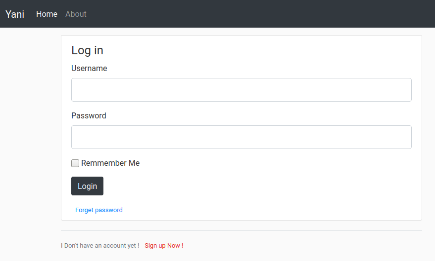
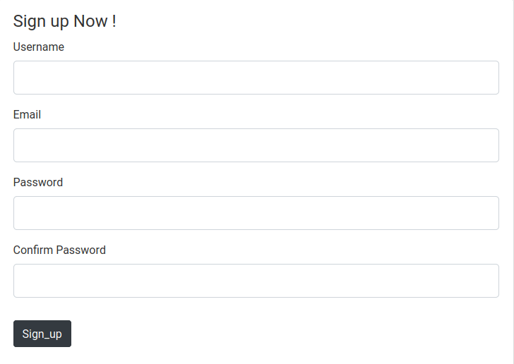

# web application for share posts

## run :

- clone the repository.

### 1. Vertualenv :

1. install the requirements ```pip3 install -r requirements.txt

2. then init the env variables :

- export `FLASK_APP=app.py` (the application will take post:5000 )

- export FLASK_ENV=development

- flask run

### 2. docker-compose :

- `docker-compose up --build`

### _Screen shots:_

1. _Home_ :


2. _Login_ :



3. _Sign in_ :


